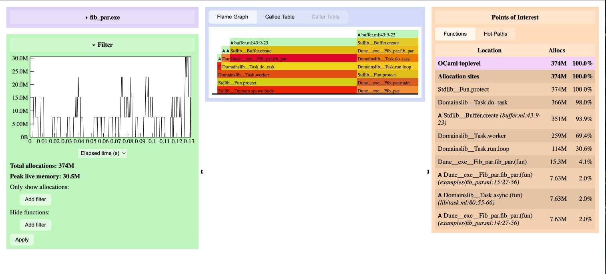
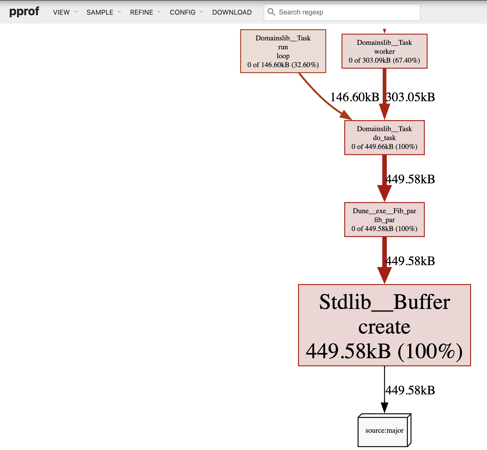
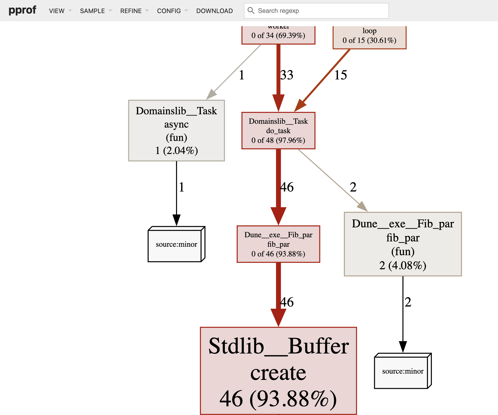

# Protobuf format

We provide a CLI tool for converting memtrace files into the protobuf format, so they can be visualised using pprof.

## Protobuf Conversion CLI tool

To convert a memtrace .ctf file to the protobuf format, you can run:

```shell
# Generate and zip profile data

$ dune exec bin/convert.exe <trace_file> <output_file>
$ gzip <output_file>

# Start web UI for viewing profile data
$ ~/go/bin/pprof -http localhost:8080 <output_file>
```

As an example, consider the output generated from the example [fib_par file](./../examples/fib_par.ml):



The corresponding protobuf file produces the following output:



you can click the "sample" drop-down menu to view allocations by the number of traces they appear in instead of the amount of memory allocated:



## what is missing

Pprof uses "mappings" to resolve memory addresses to symbol information. For pure OCaml code, mappings are generally not required, since memtrace already provides symbolic information. However, mappings can be useful if the program interacts with native OCaml runtime components or uses FFI libraries. Unfortunately, memtrace doesn’t expose this mapping information directly, and supporting it would require emitting protobuf data in real time. For now we use a dummy mapping, without which pprof cannot find the main binary name and produces an incomplete graph.

In future when writing the protobuf data directly we will need to lookup addresses for symbols.

When viewing a flamegraph in pprof, you can right-click on a location and view it's source code: another feature that uses information from the mappings that are missing in our conversion tool.

## On the Go GC

Since the premise of this work is reusing the Go tooling and visualisations, it is useful to understand what kind of Garbage Collector Go uses.

Go uses a Tracing Garbage Collector with the following properties:
 * hybrid stop-the-world/concurrent collector
 * stop-the-world limited by a deadline (10 ms)
 * concurrent collector runs in parallel on CPU cores
 * tri-colour mark-and-sweep algorithm
 * non-generational
 * non-compacting
 * fully precise

Stop-the-world refers to a stage of the GC algorithm where all mutators are halted. In Go it seems they have a deadline mechanism on these stop-the-world sections. The collector runs on a separate CPU core in parallel with the main program. (Unclear how work is partitioned and synchronised to allow this). They claim "pause times often to the sub-millisecond range".

Tricolour abstraction a characterisation of the work of the garbage collector as partitioning *objects* into *white* (not get visited) and *black* (need not be visited), using *grey* to represent the remaining work (to be revisited).

> modern memory allocation algorithms, like the tcmalloc-based approach used by the Go runtime, have essentially no fragmentation issues.

> The original plan was to do a read barrier free concurrent copying GC. ... uncertainty about the overhead of read barriers

Go uses size segregated spans to find the start of an object and for their low fragmentation properties. Based off previous experience with Intel's Scalable Malloc and Google's TCMalloc and Hoard. They were convinced fragmentation was not going to be a problem. No compacting necessary?

> The write barrier is on only during the GC.

The runtime looks at a global variable to determine if it's in the GC. When in the GC the write barrier is responsible for ensuring that no reachable objects get lost during the tri-color operations.

Go differs from many garbage collected languages in that many objects are allocated directly on the program stack. The Go compiler uses escape analysis to find object whose lifetime is known at compile time and allocates them on the stack rather than in garbage collected memory. So in Go a larger percentage of the quickly-unused values that a generational GC looks for are never allocated in GC memory to begin with.

Another reason for a generational GC is to reduce the amount of time a program pauses for garbage collection (aka stop-the-world time).

Precision refers to how the GC tracks the root objects and what objects are retained at the end of a collection cycle. A *stop-the-world* collector gains maximum precision (all unreachable objects are collected) at the expense of any concurrency with the mutator. This seems at odds with the concurrent collector.


Terminology:
 * object: a dynamically allocated piece of memory that contains one or more Go values.
 * pointer: a value that is an *address* in memory, typically of an *object*.
 * object graph: *objects* and *pointers* together from the *object graph*.
 * mutator: the users program, so called because from the *collector's* poin t of view it simply mutates the graph of objects.
 * stop-the-world collection: a technique for *collection* during which all *mutator threads* are halted

References:
 * [Getting to Go: The Journey of Go's Garbage Collector](https://go.dev/blog/ismmkeynote)
 * [A Guide to the Go Garbage Collector](https://tip.golang.org/doc/gc-guide)
 * [golang-nuts post by Ian Lance Taylor](https://groups.google.com/g/golang-nuts/c/KJiyv2mV2pU)